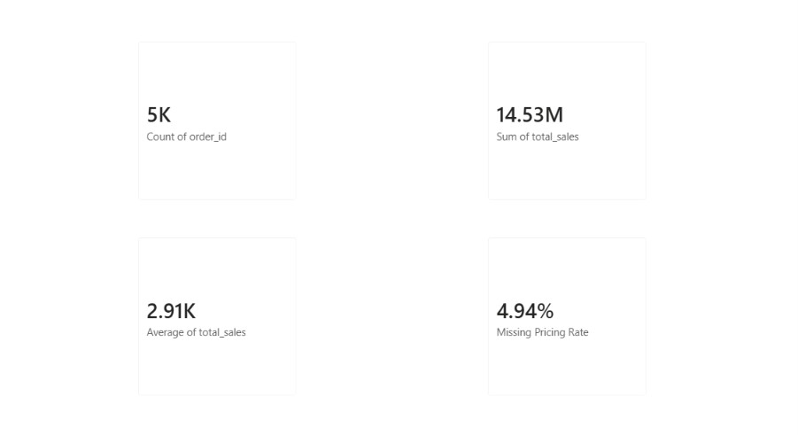
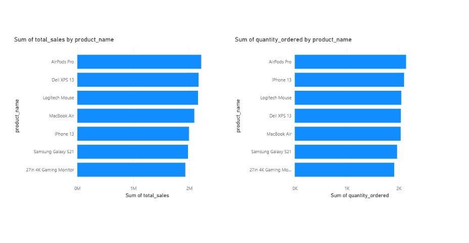
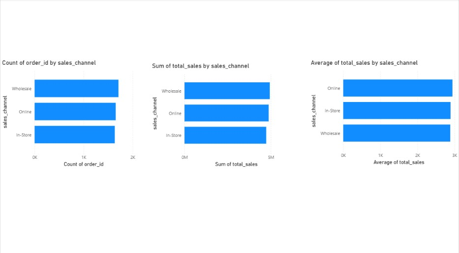
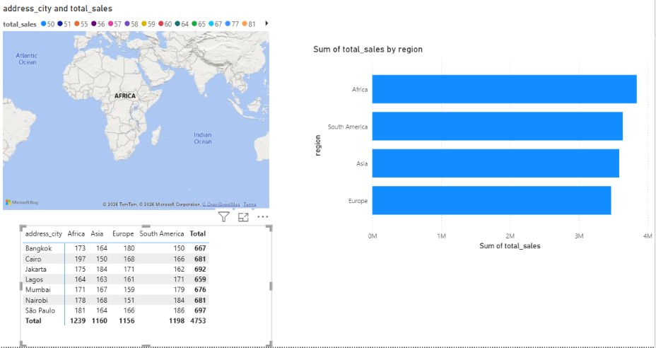
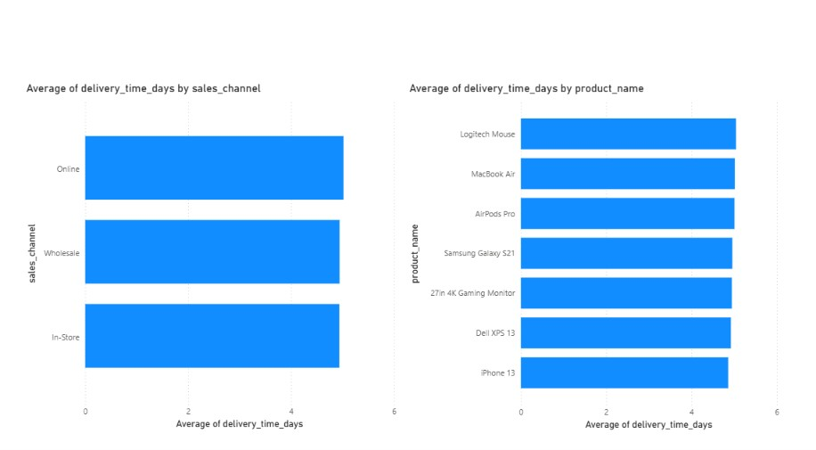

# Sales Analytics Pipeline

SQL, Python, and Power BI pipeline analyzing e-commerce sales data — cleaning encoding issues, mismatched location fields, and missing pricing to surface channel and regional performance insights.

**Stack:** PostgreSQL · Python (pandas, sqlalchemy) · Power BI

## Project Overview

This project works through 5,000 real world style ecommerce sales transactions containing genuine data quality problems: mixed date formats, character encoding corruption, whitespace padding, missing pricing data, and — most notably — a location field that turned out to be unreliable for 86% of records.

The pipeline follows this three stage approach:
1. **SQL** for mechanical, auditable cleaning (type casting, standardization, whitespace handling)
2. **Python** for lighter touch profiling and visual confirmation of SQL driven findings
3. **Power BI** for the final interactive dashboard

## Key Findings

The `city` column was wrong 86% of the time and was replaced with a derived, verified `address_city` field. A second column, `region`, showed no reliable relationship to city at all and was excluded from geographic analysis. Wholesale leads on order volume and total revenue, but Online has the highest average order value. About 5% of orders had missing pricing data, evenly distributed with no clear root cause.

Full findings and methodology: [key_takeaways.md](key_takeaways.md)

## Repository Structure

```
├── data/
│   ├── raw/              Original sales_dataset_5000_rows.csv
│   └── final/             Cleaned, flagged final_sales.csv
├── sql/
│   └── sales_pipeline.sql   Staging setup, load, profiling, and clean table transformations
├── notebooks/
│   ├── connect.py           Postgres connection script
│   └── sales_analysis.ipynb  Data quality profiling and visual confirmation
├── dashboard/
│   ├── sales_dashboard.pbix
│   └── screenshots/         Page by page dashboard previews
└── key_takeaways.md          Findings summary
```

## Dashboard Preview

### Overview


### Sales by Product


### Channel Performance


### Regional Breakdown


### Delivery Time


## Reproducing This Project

**1. Set up the database**
```
psql -U postgres -f sql/sales_pipeline.sql
```
(Update the `\copy` file path in the script to point to your local `data/raw/` folder first.)

**2. Run the Python profiling notebook**

Set your Postgres password as an environment variable before running:
```
set PG_PASSWORD=your_password_here
```
Then open `notebooks/sales_analysis.ipynb` and run through the cells. This writes the final flagged table (`final_sales`) back to Postgres and exports it to `data/final/`.

**3. Open the dashboard**

Open `dashboard/sales_dashboard.pbix` in Power BI Desktop and connect it to your local `sales_analysis` Postgres database.

## Notes

This dataset's `region` and `delivery_time_days` fields show flat or effectively random distributions with no meaningful relationship to other fields — most likely an artifact of how the dataset was generated rather than a genuine business pattern. These are called out explicitly in the findings rather than presented as insights, since distinguishing a real signal from a flat/synthetic one is part of the analysis itself. A character encoding issue affecting non-ASCII city names (e.g. "São Paulo") was diagnosed down to a terminal display setting rather than corrupted data, and confirmed resolved through Power BI directly reading the correct underlying bytes.
